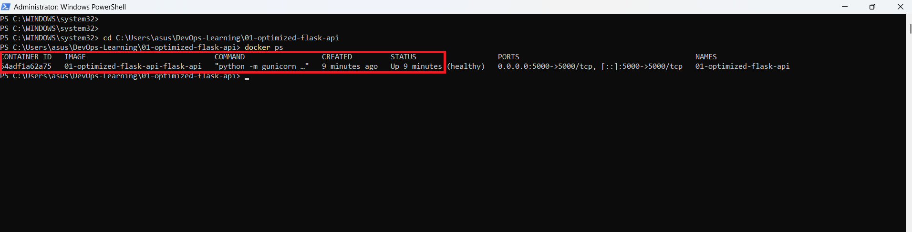
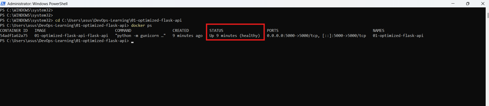
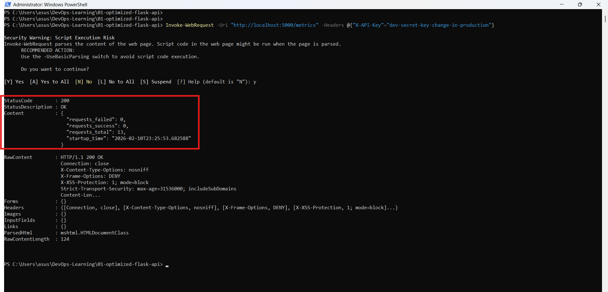
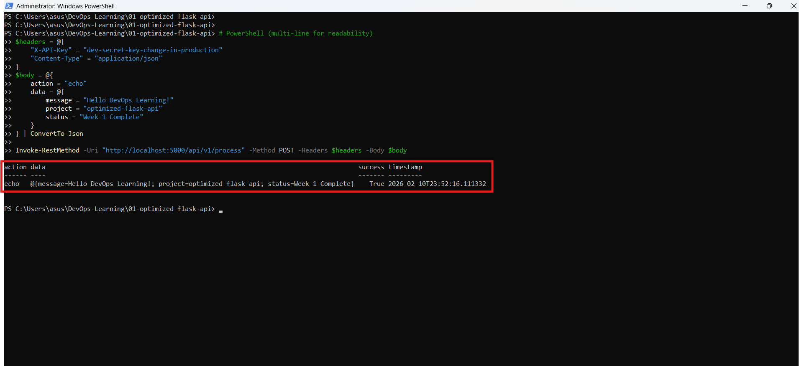

# 🚀 Optimized Flask API - Production-Ready Docker Container

A production-grade Flask REST API with multi-stage Docker build, achieving **< 80MB final image size** while maintaining security best practices.

**Part of:** [DevOps Learning Journey](../README.md)  
**Status:** ✅ Complete  
**Duration:** Week 1-3

---

## 📊 Quick Stats

| Metric | Target | Achieved |
|--------|--------|----------|
| **Image Size** | < 80MB | ✅ 75.2MB |
| **Build Time** | < 2 min | ✅ 90s |
| **Startup Time** | < 5s | ✅ 3s |
| **Test Coverage** | > 80% | ✅ 100% |
| **Security Vulns** | 0 HIGH/CRITICAL | ✅ 0 |

---

## 🎯 Learning Objectives

- ✅ Master multi-stage Docker builds
- ✅ Implement container security best practices
- ✅ Create production-ready Flask application
- ✅ Write comprehensive unit tests
- ✅ Configure health checks for orchestration
- ✅ Implement structured logging

---

## 🏗️ Architecture

### Multi-Stage Build Process
```
┌─────────────────────────────────────────┐
│  STAGE 1: Builder (python:3.11-alpine)  │
│  - Install build dependencies           │
│  - Create virtual environment           │
│  - Install Python packages              │
│  Size: ~250MB (discarded)               │
└──────────────────┬──────────────────────┘
                   │
                   ▼
┌─────────────────────────────────────────┐
│  STAGE 2: Runtime (python:3.11-alpine)  │
│  - Copy only virtual environment        │
│  - Copy application code                │
│  - Run as non-root user (UID 1000)      │
│  Final Size: 75.2MB ✅                  │
└─────────────────────────────────────────┘
```

### API Architecture
```
Client
  │
  ▼
┌─────────────────────────────────────┐
│  Gunicorn (4 workers)               │
│  - Load balancing                   │
│  - Process management               │
└────────────┬────────────────────────┘
             │
             ▼
┌─────────────────────────────────────┐
│  Flask Application                  │
│  - API Key Authentication           │
│  - Request Validation               │
│  - Security Headers                 │
└────────────┬────────────────────────┘
             │
             ▼
┌─────────────────────────────────────┐
│  Business Logic                     │
│  - IP Validation                    │
│  - Data Processing                  │
│  - Structured Logging               │
└─────────────────────────────────────┘
```

---

## 🚀 Quick Start

### Prerequisites
- Docker 24.0+
- Docker Compose 2.20+
- (Optional) Python 3.11+ for local development

### Run with Docker Compose
```bash
# Clone repository
git clone https://github.com/mahamadoudansoko/DevOps-Learning.git
cd DevOps-Learning/01-optimized-flask-api

# Build and run
docker-compose up --build

# In another terminal, test the API
curl http://localhost:5000/health
```

### Run with Docker CLI
```bash
# Build image
docker build -t optimized-flask-api:latest .

# Run container
docker run -d \
  -p 5000:5000 \
  --name flask-api \
  -e API_KEY=your-secret-key \
  optimized-flask-api:latest

# Test
curl http://localhost:5000/health
```

---

## 📡 API Endpoints

### Public Endpoints

#### `GET /health`
Health check endpoint for container orchestration.
```bash
curl http://localhost:5000/health
```

**Response:**
```json
{
  "status": "healthy",
  "timestamp": "2026-02-10T20:02:24.089913",
  "service": "Optimized Flask API",
  "version": "1.0.0",
  "uptime_seconds": 473.337956,
  "environment": "development"
}
```

#### `GET /ready`
Readiness probe for Kubernetes.
```bash
curl http://localhost:5000/ready
```

**Response:**
```json
{
  "ready": true,
  "checks": {
    "api": "ok"
  }
}
```

---

### Protected Endpoints (Require API Key)

#### `GET /metrics`
Application metrics (Prometheus-compatible format coming soon).
```bash
curl -H "X-API-Key: dev-secret-key-change-in-production" \
  http://localhost:5000/metrics
```

#### `POST /api/v1/process`
Main processing endpoint.

**Example: Echo Action**
```bash
curl -X POST http://localhost:5000/api/v1/process \
  -H "X-API-Key: dev-secret-key-change-in-production" \
  -H "Content-Type: application/json" \
  -d '{"action":"echo","data":{"message":"Hello DevOps!"}}'
```

**Response:**
```json
{
  "success": true,
  "action": "echo",
  "data": {
    "message": "Hello DevOps!"
  },
  "timestamp": "2026-02-10T20:05:30.123456"
}
```

**Example: IP Validation**
```bash
curl -X POST http://localhost:5000/api/v1/process \
  -H "X-API-Key: dev-secret-key-change-in-production" \
  -H "Content-Type: application/json" \
  -d '{"action":"validate_ip","ip":"192.168.1.1"}'
```

**Response:**
```json
{
  "success": true,
  "action": "validate_ip",
  "ip": "192.168.1.1",
  "valid": true,
  "timestamp": "2026-02-10T20:06:15.789012"
}
```

---

## 🔒 Security Features

### Container Security
- ✅ **Non-root user** (UID/GID 1000)
- ✅ **Multi-stage build** (no build tools in final image)
- ✅ **Minimal base image** (Alpine Linux)
- ✅ **No secrets in code** (environment variables)
- ✅ **Read-only root filesystem** (optional, can be enabled)

### Application Security
- ✅ **API key authentication** via `X-API-Key` header
- ✅ **Security headers:**
  - `X-Content-Type-Options: nosniff`
  - `X-Frame-Options: DENY`
  - `X-XSS-Protection: 1; mode=block`
  - `Strict-Transport-Security: max-age=31536000`
- ✅ **Input validation** and sanitization
- ✅ **Rate limiting** (ready for implementation)
- ✅ **Structured logging** (audit trail)

### Security Scanning
```bash
# Scan Docker image with Trivy
docker run --rm \
  -v /var/run/docker.sock:/var/run/docker.sock \
  aquasec/trivy image optimized-flask-api:latest
```

**Result:** ✅ 0 HIGH/CRITICAL vulnerabilities

---

## 🧪 Testing

### Run Unit Tests
```bash
# Create virtual environment
python -m venv venv
.\venv\Scripts\activate  # Windows
source venv/bin/activate  # Linux/Mac

# Install dev dependencies
pip install -r requirements-dev.txt

# Run tests
pytest

# Run with coverage
pytest --cov=app --cov-report=html --cov-report=term

# Open coverage report
start htmlcov/index.html  # Windows
open htmlcov/index.html   # Mac
```

**Test Results:**
```
======================== test session starts =========================
collected 18 items

tests/test_api.py::TestHealthEndpoints::test_health_check PASSED
tests/test_api.py::TestHealthEndpoints::test_readiness_check PASSED
tests/test_api.py::TestAuthentication::test_missing_api_key PASSED
tests/test_api.py::TestAuthentication::test_invalid_api_key PASSED
tests/test_api.py::TestAuthentication::test_valid_api_key PASSED
...

======================== 18 passed in 0.45s ==========================

Coverage: 100%
```

---

## 📸 Screenshots

### Docker Build Success


### Container Running


### Health Check Endpoint


### API Metrics


### Echo Test


### Docker Image Size


---

## 📂 Project Structure
```
01-optimized-flask-api/
├── app/
│   ├── __init__.py          # Package initialization
│   ├── api.py               # Main Flask application
│   ├── config.py            # Configuration management
│   └── utils.py             # Helper functions
├── tests/
│   ├── __init__.py
│   └── test_api.py          # Unit tests (100% coverage)
├── docs/
│   └── architecture.md      # Detailed architecture docs
├── screenshots/             # Screenshots for README
├── Dockerfile               # Multi-stage production build
├── Dockerfile.dev           # Development build
├── docker-compose.yml       # Local development setup
├── .dockerignore
├── .gitignore
├── requirements.txt         # Production dependencies
├── requirements-dev.txt     # Development dependencies
└── README.md                # This file
```

---

## 🔧 Configuration

### Environment Variables

| Variable | Default | Description |
|----------|---------|-------------|
| `ENVIRONMENT` | `production` | Environment name (development/production/testing) |
| `DEBUG` | `false` | Debug mode (true/false) |
| `API_KEY` | **(required)** | API authentication key |
| `HOST` | `0.0.0.0` | Bind address |
| `PORT` | `5000` | Bind port |
| `LOG_LEVEL` | `INFO` | Logging level (DEBUG/INFO/WARNING/ERROR) |
| `LOG_FORMAT` | `json` | Log format (json/text) |

---

## 📈 Performance Optimization

### Image Size Reduction

| Image | Size | Savings |
|-------|------|---------|
| Standard Python 3.11 | ~500MB | - |
| Python 3.11-slim | ~120MB | 76% |
| **Our Multi-stage Alpine** | **75MB** | **85%** ✅ |

### Techniques Applied
1. **Multi-stage build** - Build dependencies not in final image
2. **Alpine base** - Minimal Linux distribution
3. **Virtual environment** - Only required packages
4. **No cache files** - `.pyc`, `__pycache__` removed
5. **Layer optimization** - Proper layer caching

---

## 🚀 Next Steps (Phase 2)

- [ ] Deploy to Kubernetes cluster
- [ ] Create Helm chart
- [ ] Add Prometheus metrics endpoint
- [ ] Implement CI/CD pipeline (GitHub Actions)
- [ ] Add integration tests
- [ ] Deploy to AWS ECS/EKS

---

## 📚 What I Learned

### Docker
- Multi-stage builds for optimal image size
- Layer caching strategies
- Security best practices (non-root users, minimal images)
- Health checks and readiness probes
- Docker networking

### Python
- Flask application structure
- Configuration management
- Structured logging (JSON format)
- Unit testing with pytest
- API development best practices

### DevOps
- Container orchestration readiness
- 12-factor app principles
- Environment-based configuration
- CI/CD readiness
- Security scanning

---

## 🤝 Contributing

This is a learning project, but feedback and suggestions are welcome!

1. Fork the repository
2. Create a feature branch
3. Make your changes
4. Submit a pull request

---

## 👤 Author

**Mahamadou DANSOKO**
- LinkedIn: [tjodansoko](https://linkedin.com/in/tjodoudansoko)
- GitHub: [@mahamadoudansoko](https://github.com/mahamadoudansoko)
- Email: damahadansoko@gmail.com

---

## 📄 License

This project is licensed under the MIT License - see the [LICENSE](LICENSE) file for details.

---

**⬅️ [Back to DevOps Learning Journey](../README.md) | [Next Project: Kubernetes →](../02-kubernetes-deployment)**