# ⚓ Kubernetes Deployment - Microservices Orchestration

Deploy the Flask API to Kubernetes with auto-scaling, ingress, persistent storage, and service mesh.

**Part of:** [DevOps Learning Journey](../README.md)  
**Status:** ✅ Completed (Week 4-6)  
**Prerequisites:** Completion of [01-optimized-flask-api](../01-optimized-flask-api)

---

## 🎯 Learning Objectives

- [x] Understand Kubernetes architecture (pods, nodes, clusters)
- [x] Master kubectl commands and YAML manifests
- [x] Deploy multi-container applications
- [x] Configure ConfigMaps and Secrets
- [x] Implement Horizontal Pod Autoscaling (HPA)
- [ ] Set up Ingress controllers (NGINX)
- [ ] Manage persistent volumes (PV/PVC)
- [ ] Create and publish Helm charts
- [ ] Implement service mesh basics (optional)

---

## ✅ What We Accomplished

### 🐳 Docker
- Built and optimized the Flask API Docker image
- Tagged and pushed image to Docker Hub: `dansokomaha/optimized-flask-api:latest`

### ☸️ Kubernetes Deployment (Minikube)
- Set up a local Kubernetes cluster with **Minikube v1.35.1**
- Created a dedicated **namespace** `flask-app`
- Deployed **3 replicas** of the Flask API with zero-downtime rolling updates
- Configured **ConfigMap** for app environment variables
- Configured **Secrets** for sensitive data (API keys, DB credentials)
- Set up **ClusterIP Service** to expose the Flask API internally
- Configured **Horizontal Pod Autoscaler (HPA)**:
  - Scale up when CPU > 70%
  - Scale up when Memory > 80%
  - Max 10 pods / Min 2 pods

### 🏥 Health Checks Verified
- `/health` → `status: healthy`, `environment: production`, `version: 1.0.0`
- `/ready` → `ready: true`, `api: ok`


## 📸 Screenshots

### Container Created
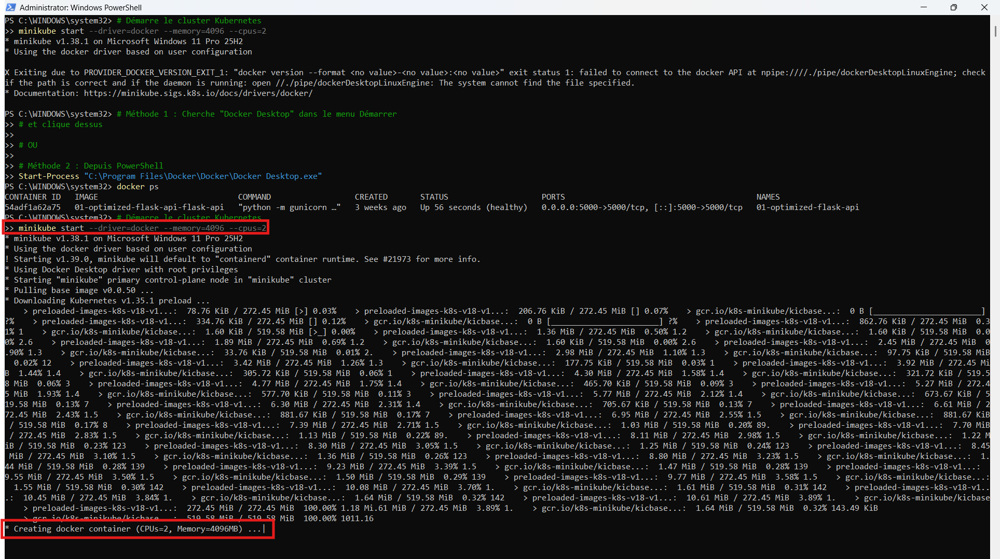

### Status of Pods
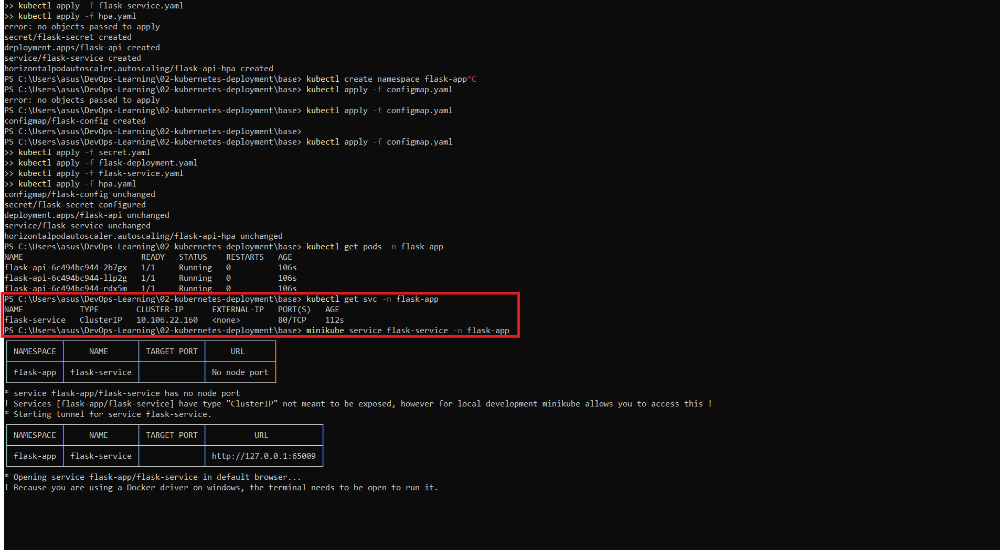

### Image Successfully Pushed
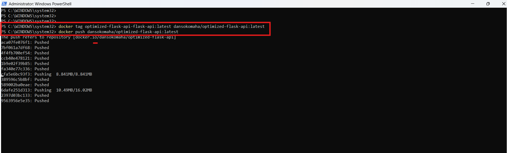

### Checked Route Health
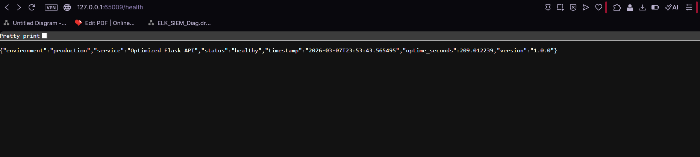

### Route Ready
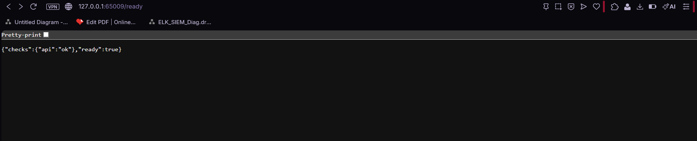


### Enable Ingress
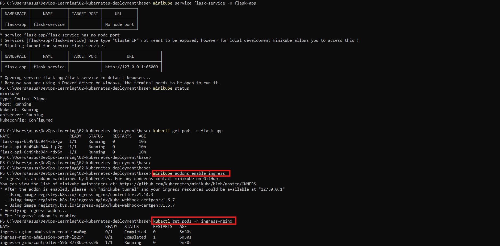
### Add App to Windows Hosts
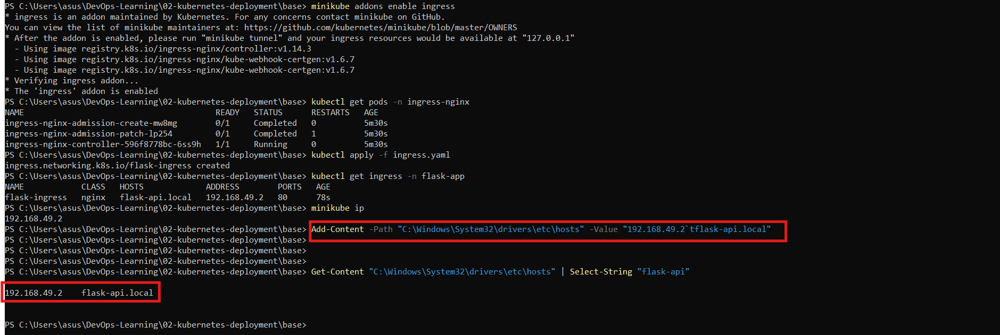

### Flask API Health Checking
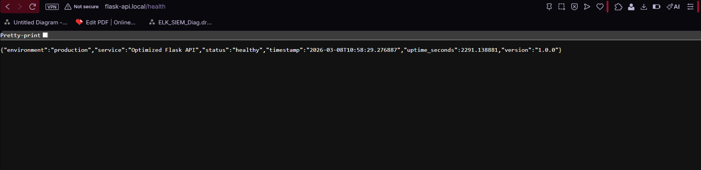

### Flask API Ready
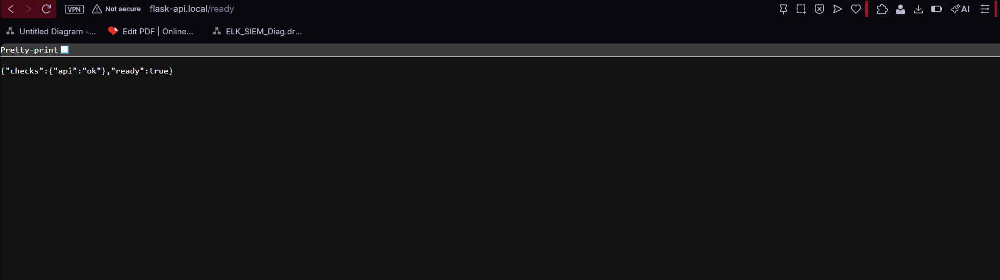

### PostgreSQL Adding
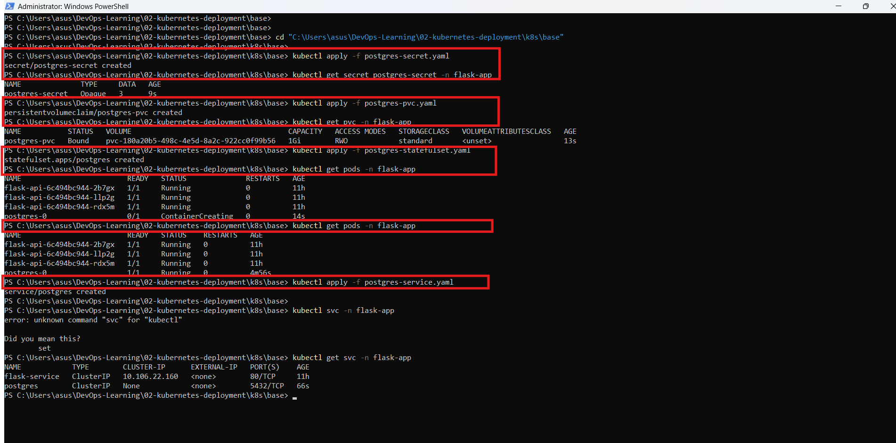

### Configuring Helm Chart
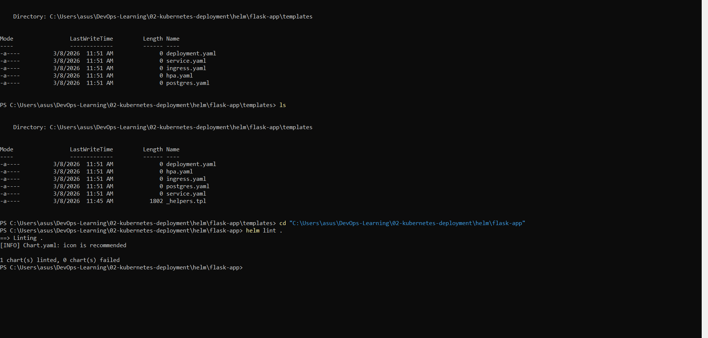

### Deploying Helm Chart 
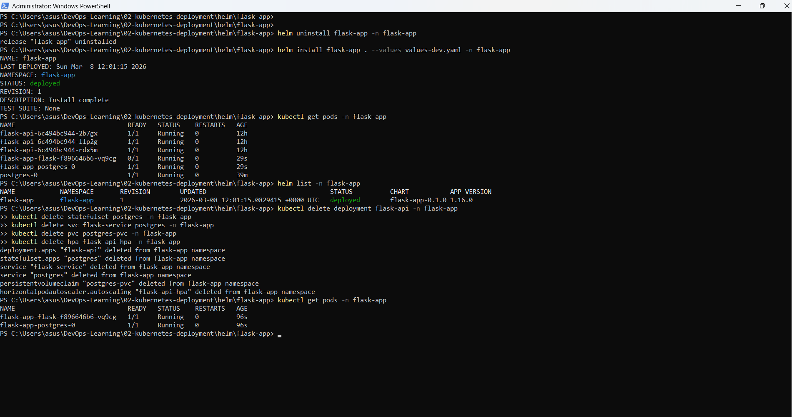

### Checking Helm Health
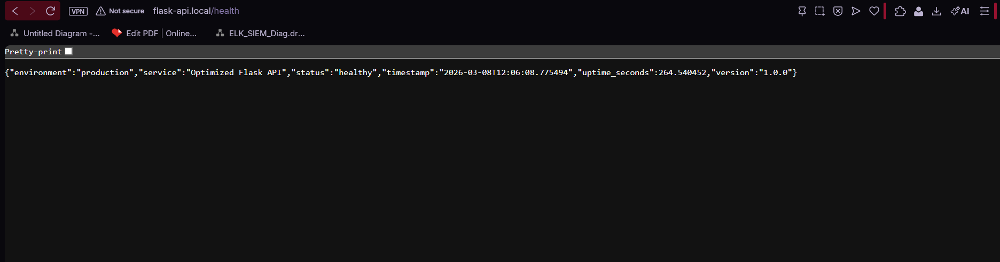

### Checking Health is Ready
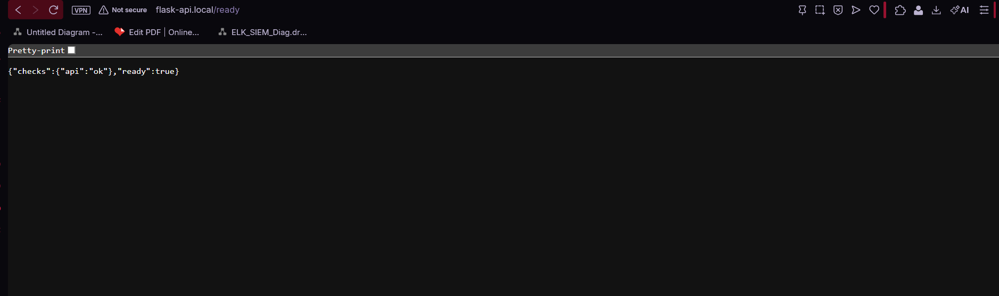


### 📁 Files Structure
```
02-kubernetes-deployment/
├── README.md
└── base/
    ├── namespace.yaml       # flask-app namespace
    ├── configmap.yaml       # App configuration
    ├── secret.yaml          # Sensitive credentials
    ├── flask-deployment.yaml # 3 replicas, rolling update
    ├── flask-service.yaml   # ClusterIP Service
    └── hpa.yaml             # Autoscaling config
```

---

## 🏗️ Architecture
```
                     Internet
                        │
                        ▼
                   ┌─────────┐
                   │ Ingress │
                   │ (NGINX) │
                   └────┬────┘
                        │
        ┌───────────────┼───────────────┐
        │               │               │
        ▼               ▼               ▼
   ┌─────────┐    ┌─────────┐    ┌─────────┐
   │  Flask  │    │  Flask  │    │  Flask  │
   │   Pod   │    │   Pod   │    │   Pod   │
   │ (App 1) │    │ (App 2) │    │ (App 3) │
   └─────────┘    └─────────┘    └─────────┘
```

---

## 🚀 Quick Start
```bash
# Start Minikube
minikube start

# Deploy everything
kubectl create namespace flask-app
kubectl apply -f base/configmap.yaml
kubectl apply -f base/secret.yaml
kubectl apply -f base/flask-deployment.yaml
kubectl apply -f base/flask-service.yaml
kubectl apply -f base/hpa.yaml

# Access the application
minikube service flask-service -n flask-app

# Check pods
kubectl get pods -n flask-app
```

---

## 📈 Success Metrics

- [x] Application runs with 3 replicas
- [x] Auto-scaling configured (CPU > 70%, Memory > 80%)
- [x] Zero-downtime rolling updates configured
- [x] Health checks passing (`/health`, `/ready`)
- [x] Image published to Docker Hub
- [ ] Persistent data survives pod restarts
- [ ] Ingress accessible from browser
- [ ] Helm chart published to repository

---

## 🛠️ Technologies Used

- **Kubernetes:** v1.35.1
- **Minikube:** v1.35.1
- **kubectl:** Latest
- **Docker Hub:** `dansokomaha/optimized-flask-api:latest`
- **Flask API:** Python, Gunicorn

---

## 📚 Resources

- [Kubernetes Documentation](https://kubernetes.io/docs/)
- [Helm Documentation](https://helm.sh/docs/)
- [KodeKloud Kubernetes Course](https://kodekloud.com/courses/kubernetes-for-beginners/)

---

**⬅️ [Previous: Docker Optimization](../01-optimized-flask-api) | [Next: Terraform IaC →](../03-terraform-aws-infrastructure)**